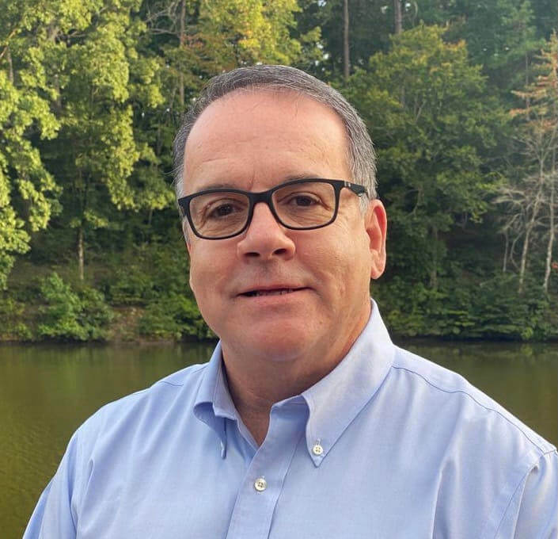

[Home](index.html){: .btn}
[About](about.html){: .btn.current}
<!-- [Services](services.html){: .btn} -->
[Contact](contact.html){: .btn}

## About

Mountaineer Bio is an independent consulting firm providing specialist services in pharma R&D space. It was founded by Jim Demarest.

{: .bio}
 
Jim Demarest, PhD

**Independent Consultant**
 
Founder and Manager
 
Mountaineer Bio, LLC

**Adjunct Faculty**
 
Duke University Medical Center, Department of Immunology
 
High Point University, Department of Biology

With >31 years of experience (23+ in pharma), Jim brings strategic translational approaches that break down silos in order to advance drug discovery and development to commercialization.  His career trajectory took him from NIH (Dr. Anthony Fauci’s laboratory) to Duke University, to GlaxoWellcome/GSK, ViiV Healthcare, AbbVie Immunology, and consultancies.  Jim was a founding member of the scientific and medical organization at ViiV Healthcare (launched in Nov 2009; ViiV), an HIV-focused joint venture of GSK and Pfizer.  In this independent and virtual R&D organization, he influenced the evolving discovery and development strategy within ViiV and its key discovery partners that led to a change in portfolio direction, identified and initiated public-private partnerships with PENTA Foundation and the French ANRS, defined and led the R&D effort to alleviate a post-marketing commitment for a companion diagnostic, and co-designed the internal discovery and early clinical development processes new to ViiV following acquisition of the Bristol Myers Squibb HIV drug discovery unit.  He has also worked closely with medical affairs and commercial/marketing organizations on global, regional, and local market projects/campaigns associated with maraviroc and the dolutegravir-based portfolio at ViiV and Adalimumab and Risankizumab at AbbVie.  Jim knows from firsthand experience the components necessary to strategically integrate the scientific, clinical, regulatory, medical affairs, and commercial work streams to bring forward relevant medicines that address unmet patient needs.  He understands what is essential for successful public-private pharma partnerships with biotech and/or academia as well as viable business development opportunities.  More recently, he is also a co-inventor on a small molecule discovery program with Clear Creek Bio that advanced to a research collaboration with Pfizer CCB-PFE Link.  I bring this breadth of experience to advance innovative approaches for R&D.
